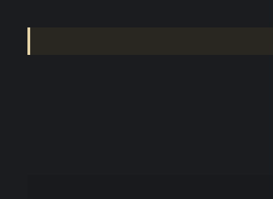
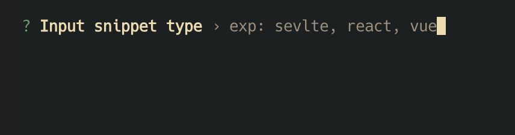
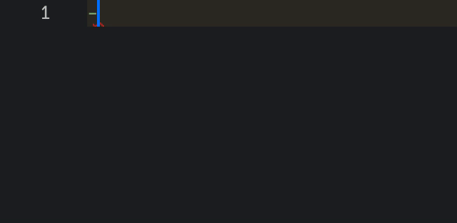

<p align="center">
  <a href="https://www.npmjs.com/package/csnp" target="_blank" rel="noopener noreferrer">
    
  </a>
</p>

<h1 align=center>csnp</h1>

<p align=center>A cli-tool for generating VSCode code snippets.</p>

<p align=center>
  
</p>



## Install
```bash
$ npm i -g csnp

$ yarn i -g csnp

$ pnpm i -g csnp

$ bun i -g csnp
```

## `csnp`

Using interactive prompts to generate .csnp files for managing vscode code snippets.



### Rule csnp path

`.csnp/js/log.csnp`

match

`.csnp/{SnippetType}/{SnippetFileName}.csnp`

```yaml
SnippetType: js
SnippetFileName: log
```

### Details

Open file `.csnp/js/log.csnp` and edit the default code snippets.

```csnp
---
name: Log
prefix: '-log'
description: my snippet description
---
code snippets
```

The line `code snippets` is a default code snippets.

Just edit and replace it of code `console.log`.

```csnp
---
name: Log
prefix: '-log'
description: log sth
---
console.log($1)
```

After using `csnp push`, input the prefix `-log` and press Enter to generate the code.



## .csnp to code-snippets

Transform all *.csnp files and store them locally or globally(VSCode).

```bash
# local (default)
$ csnp push

# global (VSCode)
$ csnp push --global
```

## code-snippets to .csnp

Sync all snippets from local or global(VSCode) and store in .csnp dir.

```bash
# local (default)
$ csnp pull

# global (VSCode)
$ csnp pull --global
```

## Link

<a href='https://code.visualstudio.com/docs/editor/userdefinedsnippets' target='_blank' >Using Snippet in Visual Studio Code.</a>

## License

MIT
