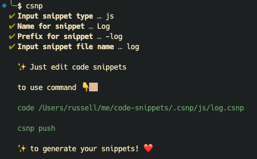
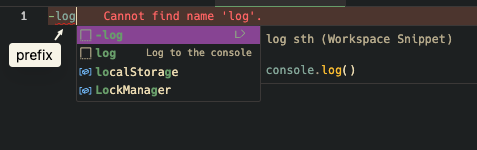
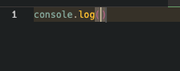

<br>

# csnp

<br>

a tool fast to generate vscode code snippets.

## Install
```bash
$ npm i -g csnp

$ yarn i -g csnp

$ pnpm i -g csnp

$ bun i -g csnp
```

## `csnp`

easily use interactive prompts to generate .csnp files for managing code snippets



### Rule csnp path

`.csnp/js/log.csnp`

match

`.csnp/{SnippetType}/{SnippetFileName}.csnp`

```yaml
SnippetType: js
SnippetFileName: log
```

### Details

open the `.csnp/js/log.csnp` to edit code snippets

```csnp
---
name: Log
prefix: '-log'
description: my snippet description
---
code snippets
```

line `code snippets` is a default code snippets

re-edit the code like `console.log`

```csnp
---
name: Log
prefix: '-log'
description: log sth
---
console.log($1)
```

after using `csnp push`,

use `-log` prefix in vscode to generate code



result:



## .csnp to code-snippets

transform all *.csnp files and store locally or global(vscode)

```bash
# local (default)
$ csnp push

# global (vscode)
$ csnp push --global
```

## code-snippets to .csnp

sync all snippets from local or global(vscode) and store in .csnp dir

```bash
# local (default)
$ csnp pull

# global (vscode)
$ csnp pull --global
```

## Link

<a href='https://code.visualstudio.com/docs/editor/userdefinedsnippets' target='_blank' >Snippets in Visual Studio Code</a>

## License

MIT