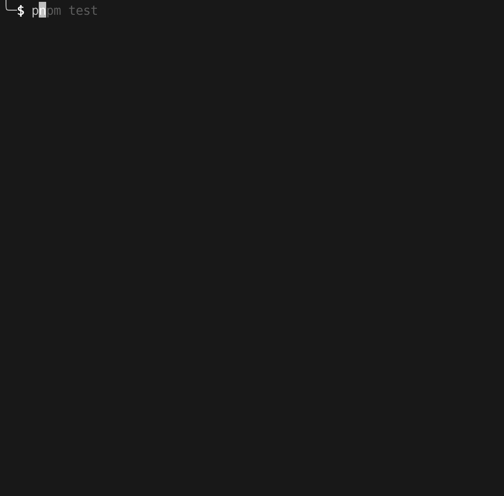
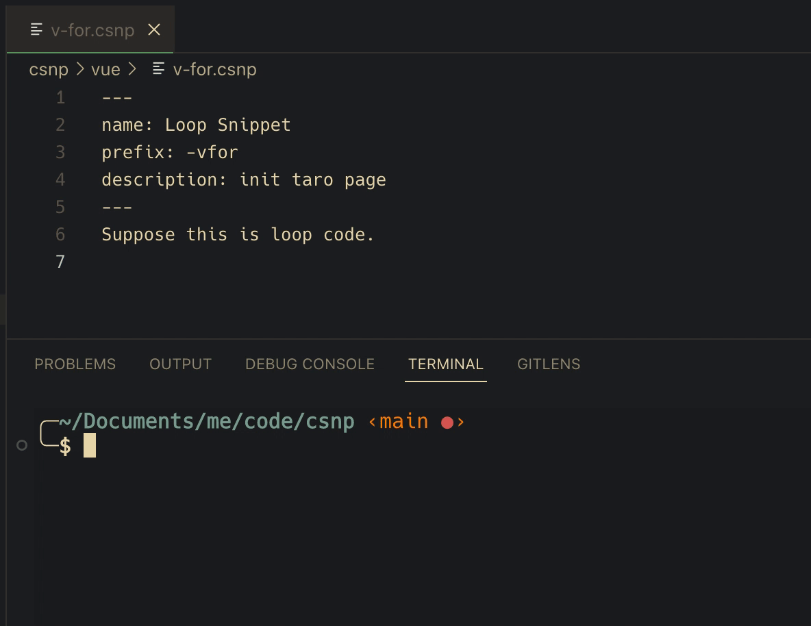

# csnp

a script fast to generate vsc code snippets.

## Work Flow
```shell
$ pnpm i

$ pnpm start

$ pnpm csnp
```

## Demo Usage

- Create vscode snippet

  

- Use in vscode

  exp: input `-clg` to generate code `console.log()`

  

- Sync local .csnp file to vscode

  
