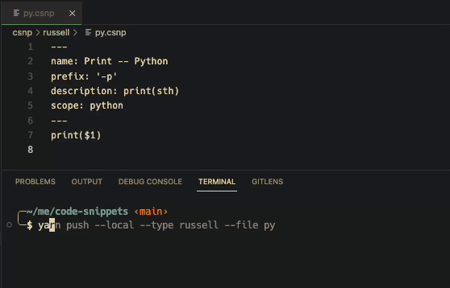

# csnp
a code snippets tool for VS Code

## Flow
```zsh
$ yarn

$ yarn run init

$ yarn run csnp
```

## Demo Usage

- Create vscode snippet

  

- Use in vscode

  

- Sync local .csnp file to vscode

  
